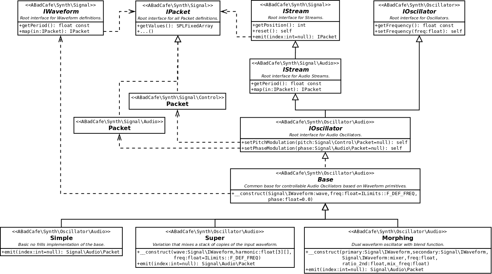

# Fundamentals > Oscillators > Audio

## Background

Audio _Oscillators_ are the fundamental building blocks of sound generation. An _Oscillator_ takes a _Waveform_ and uses it to produce a stream of audio at a given frequenency. In addition, an _Oscillator_ permits modification to it's frequency and phase using other _Signal_ sources.

## Properties

_Oscillators_ have the following key properties:

### 1. Waveform

The [_Waveform_](./Waveform.md) defines the repeating shape that the _Oscillator_ will produce over time. This property cannot be changed after construction.

### 2. Frequency

The number _Waveform_ cycles the _Oscillator_ will produce per second (Hz). Standard concert pitch is 440.0Hz. The frequency can be set after construction and can be smoothly modulated over time from some a _Control Stream_ source.

### 3. Phase

The initial offset into the _Waveform_ shape that the _Oscillator_ starts at. Phase is a normalised value, in which 1.0 represents one complete repretition of the _Waveform_ cycle. The phase can be modulated smoothly over time from some other _Audio Stream_ source. This provides the fundamental building blocks required for FM Synthesis.

## Included Oscillators

The following predefined audio _Oscillators_ are included:

### 1. Simple

The most primitive audio _Oscillator_, providing the basic services described above and nothing else.

### 2. Super

This _Oscillator_ adds a user defined stack of harmonics. Each harmonic has it's own frequency multiplier relative to the main frequency, intensity and phase offset, equivalent to using an entire set of _Simple_ _Oscillators_ mixed together.

This _Oscillator_ can be used to produce chords, detunes and other interesting effects. Particularly useful for creating thicker sounds from basic the saw _Waveforms_.

### 3. Morphing

This _Oscillator_ accepts two additional _Waveform_ parameters, a secondary and a mixer. The _Oscillator_ blends between the primary and secondary _Waveform_ shapes using the mixer _Waveform_ output value to control the mixing:

- When the mixer _Waveform_ output is 1.0, only the primary _Waveform_ is used.
- When the mixer _Waveform_ output us -1.0, only the secondary _Waveform_ is used.
- When the mixer _Waveform_ output is 0.0, both the primary and secondary _Waveforms_ are used, mixed at 50% each.

The secondary _Waveform_ frequency is set as a user-defined multiple of the fundamental, while the mixing _Waveform_ frequency is set independently.

## Entity Diagram
The following interfaces and classes make up the audio _Oscillator_ components of the system. Note the top level _Signal\IStream_, _Signal\IPacket_ and _Oscillator\IOscillator_ interfaces are first specialised into an _Audio_ subnamespace and then implemented.

