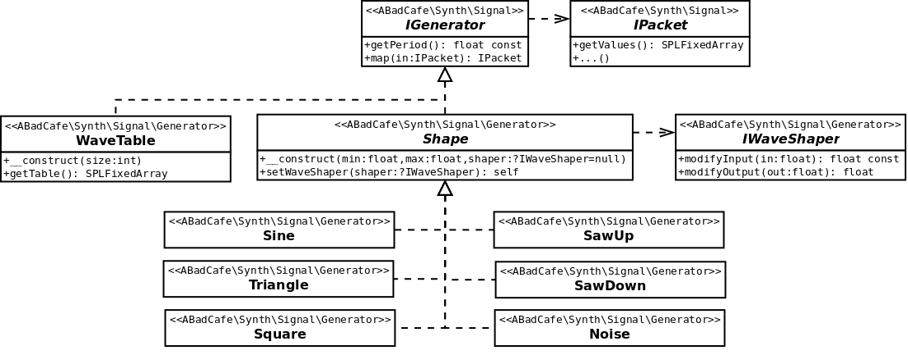

# Generators

## Background

_Generators_ represent basic periodic waveform shapes in a time/frequency independent manner. Generators are used to build _Oscillators_ which produce a time-varying output _Signal_ following the waveform shape. Generators _map_ an input _Packet_ of _x_-axis values to an output map of _y_-axis values.

_Generators_ have the following properties:

### Shape

The _Shape_ is the basic curve that the generator follows for increasing values of _x_ and repeats once every _Period_. The _Shape_ is ultimately defined by some numerical function, for example _sine()_.

### Period

The _Period_ is distance _p_ along the _x_-axis after which the _Shape_ repeats. For a simple sinewave generator, the _Period_ is 2*_PI_. The _Period_ is constant for a given _Generator_.

### Limits

The lower and upper limits for the _y_-axis values of the _Shape_. Generators allow these to to be specifed. For all _Generators_ the default is -1.0 for _Minimum Level_ and 1.0 for _Maximum Level_. These can be set differently for a given _Shape_. For example, setting the _Minimum Level_ to 0.0 and _Maximum Level_ to 2.0 has the effect of shifting the _Shape_ up the _y_-axis such that it is never usually negative.

### WaveShaper (optional)

In order to make things more interesting, an optional _WaveShaper_ can be set on a _Generator_ that subtly modifies the _Shape_ of the generator in various ways. Since a WaveShaper can modify the mapped output value of a _Generator_ it can result in values that are outside the normal limits for that _Generator_

## Included Generators

The following predifined _Generators_ are included:

### Sine

Basic _sine_ wave. Harmonically the simplest _Generator_. The _Period_ of this _Generator_ is 2*_PI_.

### Triangle

Simple Triangular wave. Linearly increases from the _Minimum Level_ to the _Maximum Level_ and then linearly decreases back to the _Minimum Level_. Richer in harmonics than _Sine_ but still relatively soft. The _Period_ this _Generator_ is 2.

### Saw Up

Saw tooth wave. Linearly increases from the _Minimum Level_ to the _Maximum Level_ then abruptly resets and repeats. Rich in harmonics. The _Period_ of this _Generator_ is 1.

### Saw Down

Saw tooth wave. Mirror image of the _Saw Up_. Linearly decreases from the _Maximum Level_ to the _Minimum Level_ then abruptly resets and repeats. Rich in harmonics. The _Period_ of this _Generator_ is 1.

### Square

Hard edge sware wave. Alternates between _Minimum Level_ and _Maximum Level_ each half period. Rich in harmonics. The _Period_ of this _Generator_ is 2.

### Noise

Pseudoramdom output (White noise). The _Period_ of this _Generator_ is 1.

### WaveTable

Custom defined waveform shape that uses a supplied array of values and linearly interpolates between them. This _Generator_ differs slightly from all of the above in the following ways:
- _Minimum Level_ and _Maximum Level_ can not be set.
- _Period_ is the size of the array.
- The size of the array is defined on construction as a given power of 2. For example, an input of 8 creates an internal table of 256 entries.

## Entity Diagram

