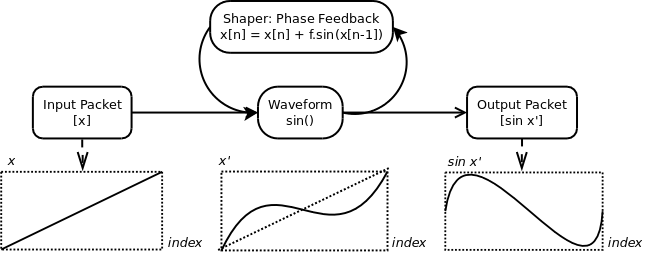

# Fundamentals > Waveform > Shaper

## Background

_Shapers_ are modifiers that can be used in conjunction with _Generators_ to modify their basic output in interesting ways. Unlike most components which process _Signal_ data in _Packets_ a _Shaper_ operates per value in a _Packet_. A _Shaper_ performs two distinct modifications:

1. Phase adjustment. The input values in the _Packet_ are modified before being passed to the fundamental function of the _Generator_.
2. Amplitude adjustment. The output value of the function is modified.

The key functionality that the _Shaper_ provides is the ability to make successive values in the output _Packet_ of the _Generator_ depend on each other in ways that are otherwise not practical when dealing with processing entire _Packets_. An example of a _Shaper_ performing a phase adjustment is depicted below.

## Included Shapers

The following predifined _Shapers_ are included:

### FixedCapacitance

This _Shaper_ models a capacitave load on the output of a _Generator_. This modifies the next output value by weighting it with previous ones. This results in softening the leading edge of any sudden transition. When applied to a basic squarewave _Generator_ the effect is to soften the leading edges in a manner similar to the charge and discharge of a capacitor. This _Shaper_ performs amplitude modification only. The strength of the effect is set on construction and cannot change.

Note that at an intensity of 1.0, the output will be zero.

The effect of the _FixedCapacitance_ _Shaper_ on a number of simple _Generator_ outputs in an _Oscillator_ at 220Hz, 44.1 kHz output are shown below.

#### 1. Sine
This shaper has little effect except at higher frequencies which are increasingly attenuated. The shape of the wave is not strongly affected. Lower frequencies, such as the test 220Hz are passed with almost no attenuation.

#### 2. Triangle
As the intensity of the shaper is increased from 0.0 to 0.95, the turning points on the wave are softened. The effect is similar to low pass filter.

#### 3. SawDown
As the intensity of the shaper is increased from 0.0 to 0.95, the turning points on the wave are softened. The effect is similar to low pass filter. However, note that the discontinuity is preserved and the rising edge and crest are softened.

#### 4. Square
As the intensity of the shaper is increased from 0.0 to 0.95, the true nature of the waveform/shaper becomes apparent. For the positive half-cycle, the output climbs logarithmically towards the level. For the negative half-cycle, the output falls exponentially towards the level. This resembles the charge/discharge voltage curve of a capacitor, from which the _Shaper_ derives it's name.

### FixedPhaseFeedback

This _Shaper_ models the Feedback behaviour of classic FM synthesis. This uses an average of the most recent output values as a phase modification for the input of the next value. This_Shaper_ performs phase modification only. When applied to a basic sinewave _Generator_ the effect is to move the waveform towards a sawtooth. The strength of the effect is set on construction and cannot change.

The effect of the _FixedPhaseFeedback_ _Shaper_ on a number of simple _Generator_ outputs in an _Oscillator_ at 220Hz, 44.1 kHz output are shown below.

#### 1. Sine
As the intensity of the shaper is increased from 0.0 to 1.0, the original wave distored towards a sawtooth. This is the primary function of this technique in classic FM synthesis.

#### 2. Triangle
As the triangle wave shape is superficially similar to the sine the effects are somewhat similar but distortion towards a sawtooth happens much more quickly. As the strength of the effect is increased the shape begins to resemble a classic sawtooth passed through a resonant lowpass filter.

#### 3. SawDown
As the intensity of the shaper is increased from 0.0 to 1.0, the transition point from minimum to maximum becomes increasingly perturbed. At 0.5 the effect is somewhat similar to a resonant lowpass filter and at 1.0 many adds many additional harmonics. The effect becomes more pronounced as the intensity is increased.

#### 4. Square
As the intensity of the shaper is increased, the crossover points become increasingly perturbed. As the square wave only has two amplitude states, this introduces a PWM effect reminiscent of early 8-bit consoles.

### FixedPhaseFeedbackWithCapacitance

This _Shaper_ is a union of the _FixedPhaseFeedback_ and _FixedCapacitance_ performing both operations simultaneously.

## Entity Diagram

