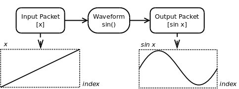
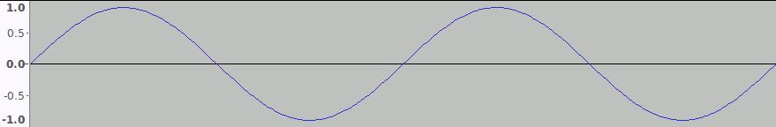
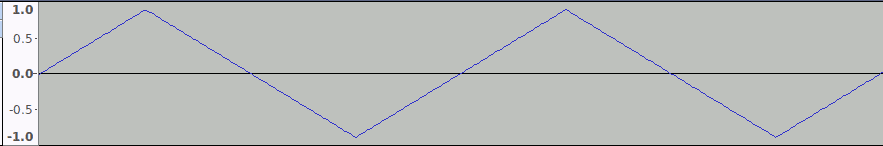
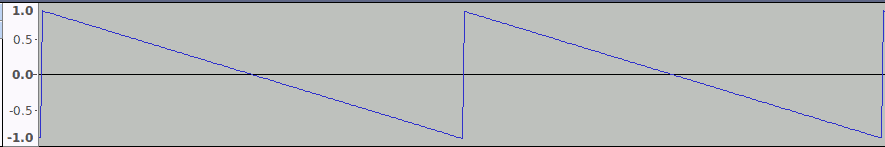
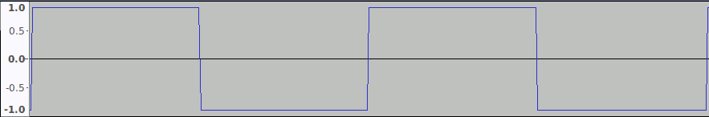
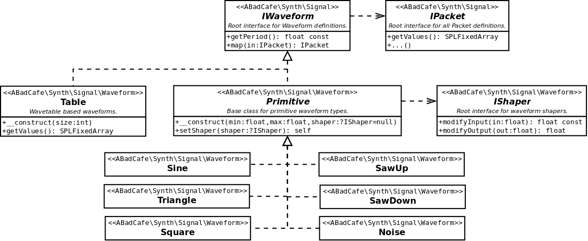

# Fundamentals > Waveform

## Background

_Waveforms_ represent basic periodic waveform shapes in a time/frequency independent manner. Waveforms are used to build _Oscillators_ which produce a time-varying output _Signal_ following the waveform shape. Waveforms _map_ an input _Packet_ of _x_-axis values to an output map of _y_-axis values. The basic behaviour is depicted below.

## Properties

_Waveforms_ have the following properties:

### 1. Shape

The _Shape_ is the basic curve that the waveform follows for increasing values of _x_ and repeats once every _Period_. The _Shape_ is ultimately defined by some numerical function, for example _sine()_.

### 2. Period

The _Period_ is distance _p_ along the _x_-axis after which the _Shape_ repeats. For a simple sine wave, the _Period_ is 2*_PI_. The _Period_ is constant for a given _Waveform_.

### 3. Limits

The lower and upper limits for the _y_-axis values of the _Shape_. Waveforms allow these to to be specifed. For all _Waveforms_ the default is -1.0 for _Minimum Level_ and 1.0 for _Maximum Level_. These can be set differently for a given _Shape_. For example, setting the _Minimum Level_ to 0.0 and _Maximum Level_ to 2.0 has the effect of shifting the _Shape_ up the _y_-axis such that it is never usually negative.

### 4. Shaper (optional)

In order to make things more interesting, an optional [_Shaper_](./Shaper.md) can be set on a _Waveform_ that subtly modifies the _Shape_ of the waveform in various ways. Since a WaveShaper can modify the mapped output value of a _Waveform_ it can result in values that are outside the normal limits for that _Waveform_.

## Included Waveforms

The following predifined _Waveforms_ are included:

### 1. Sine

Basic _sine_ wave. Harmonically the simplest _Waveform_. The _Period_ of this _Waveform_ is 2*_PI_.

This _Waveform_ supports both phase and amplitude modification using a _Shaper_.

### 2. Triangle

Simple Triangular wave. Linearly increases from the _Minimum Level_ to the _Maximum Level_ and then linearly decreases back to the _Minimum Level_. Richer in harmonics than _Sine_ but still relatively soft. The _Period_ this _Waveform_ is 2.

### 3. Saw Down

Saw tooth wave. Linearly decreases from the _Maximum Level_ to the _Minimum Level_ then abruptly resets and repeats. Rich in harmonics. The _Period_ of this _Waveform_ is 1.

This _Waveform_ supports both phase and amplitude modification using a _Shaper_.

### 4. Saw Up

Saw tooth wave. Vertically flipped mirror image of _Saw Down_.

This _Waveform_ supports both phase and amplitude modification using a _Shaper_.

### 5. Square

Hard edge sware wave. Alternates between _Minimum Level_ and _Maximum Level_ each half period. Rich in harmonics. The _Period_ of this _Waveform_ is 2.

This _Waveform_ supports both phase and amplitude modification using a _Shaper_.

### 6. Noise

Pseudoramdom white noise output. The _Period_ of this _Waveform_ is defined 1 but has no meaning since the instantaneous value of is always a pseudorandom value. This _Waveform_ supports amplitude modification using a _Shaper_ which can be used to approximage other noise types without using a _Filter_. Phase modulation has no effect.

### 7. Table

Custom defined lookup table that uses a supplied array of values and linearly interpolates between them. This _Waveform_ differs slightly from all of the above in the following ways:

- _Minimum Level_ and _Maximum Level_ can not be set.
- _Period_ is the size of the array.
- Does not support the use of a _Shaper_.
- The size of the array is defined on construction as a given power of 2. For example, an input of 8 creates an internal table of 256 entries.

## Entity Diagram
The following interfaces and classes make up the _Waveform_ components of the system. Note that the _Waveform_ map() behaviour is completely indifferent to the type of _Signal\IPacket_ given as input and in response always returns the same specific implementation type as the input. This allows the same _Waveform_ to be used in the production of audio and control signals.

